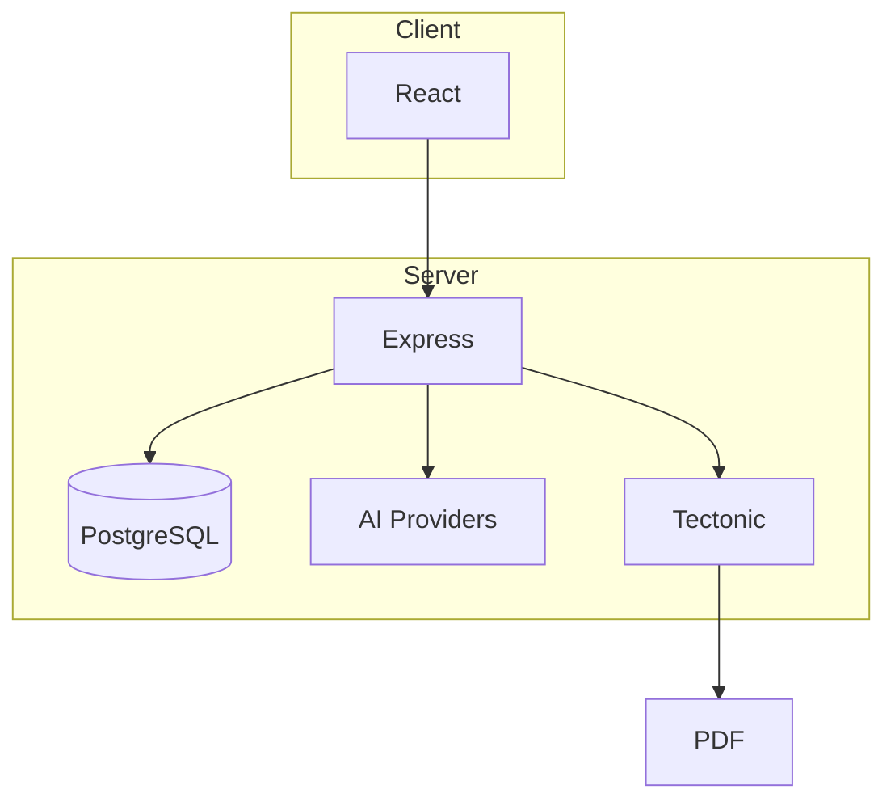
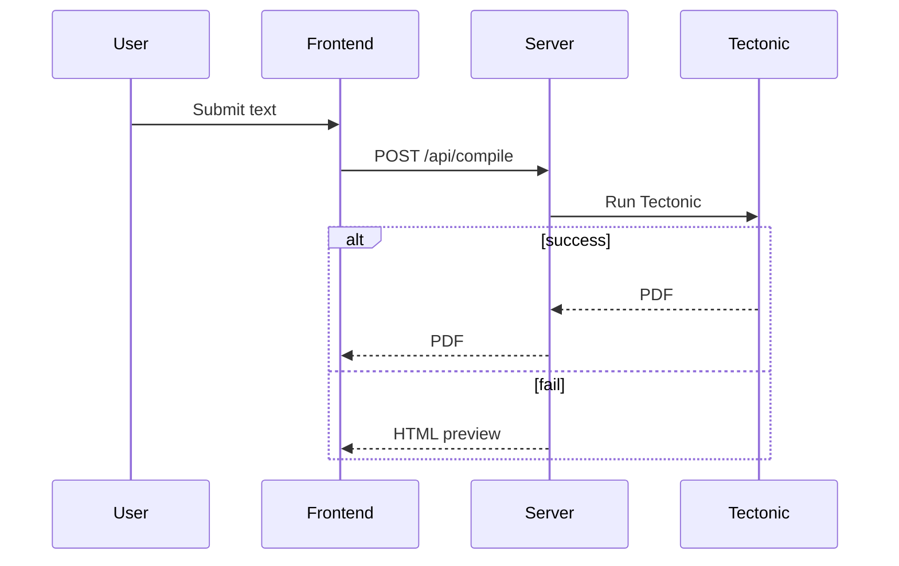

# Architecture

The server exposes REST endpoints from `server/routes.ts`. Requests can trigger AI-generated LaTeX via various providers and compile it to PDF using Tectonic. If PDF compilation fails, an HTML preview is returned so the user still receives immediate feedback.

